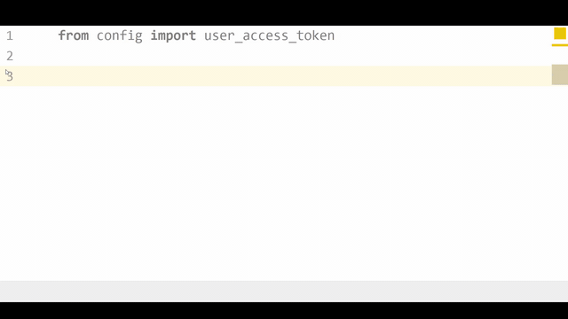
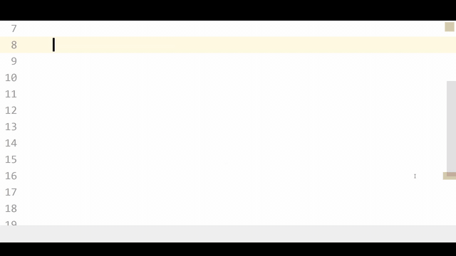
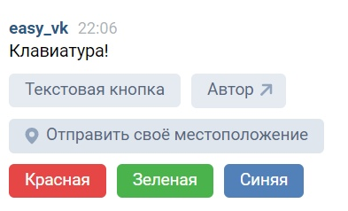

# easy_vk
Библиотека в стадии разработки

## Оглавление
1. [Особенности](https://github.com/Phinnik/easy_vk#Особенности)
1. [Установка библиотеки](https://github.com/Phinnik/easy_vk#Установка-библиотеки)
1. [Примеры использования](https://github.com/Phinnik/easy_vk#Примеры-использования)
    - [Для пользователей](https://github.com/Phinnik/easy_vk#Для-пользователей)
    - [Для ботов](https://github.com/Phinnik/easy_vk#Для-ботов)
1. [Планы на будущее](https://github.com/Phinnik/easy_vk#Планы-на-будущее)

## Особенности:
(клик по гифке для увеличения)
* Качественные подсказки:


* Подсказки, реагируют на содержание параметров



## Установка библиотеки:
```shell script
pip install easy_vk
```

## Примеры использования
### Для пользователей
```python
# Пример получения времени на сервере VK

from easy_vk.user import User

vk = User('YOUR ACCESS_TOKEN')
server_time = vk.utils.get_server_time()
print(server_time)
# 1233432
```

### Для ботов:
#### Пример использования
```python
# Пример простого Hello world бота
# (Если боту приходит сообщение 'Hello', он отправит обратно сообщение 'world')

import time
from easy_vk.bot import Bot

bot_access_token = 'BOT ACCESS TOKEN'
group_id = 123123

bot = Bot(bot_access_token, group_id)

@bot.handler.message_new(regexp='Hello')
def response(message):
    bot.messages.send(user_id = message.message.from_id, 
                      message = 'world',
                      random_id = time.time())

bot.run()
```
#### Пример реализации клавиатуры


```python
import time
from easy_vk.bot import Bot
from easy_vk.bot.keyboard import Keyboard


keyboard_template = """inline
___
||text|label::Текстовая кнопка||  ||open_link|link::https://vk.com/phinnik|label::Автор||
||location||
||text|label::Красная|color::negative||  ||text|label::Зеленая|color::positive||  ||text|label::Синяя|color::primary||
"""
keyboard = Keyboard.from_template(keyboard_template)

bot = Bot(group_access_token, group_id)

@bot.handler.message_new()
def response(message):
    bot.messages.send(user_id = message.message.from_id,
                      message = 'Клавиатура!',
                      keyboard=keyboard.to_json(),
                      random_id = time.time())

bot.run()
```


## Планы на будущее
- [X] Типизация данных VK API
- [X] Типизация ответов VK API
- [X] Создание модуля для ботов
- [ ] Создание модуля для парсинга данных
- [ ] Создание модуля базы данных
- [ ] Написание документации
- [ ] Логирование каждого модуля
- [ ] Написание полезных утилит

